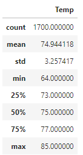
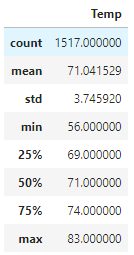

# Surf's Up Challenge
## Overview: 
The purpose of this project is to take a look at the weather data to determine if a Surf and Ice Cream Shop business would be sustainable year round.

## Results

When comparing the temperature data for June vs the temperature data for December, we can see that the standard deviation for December is 3.75 vs 3.25 for June, which means a wider spread of temperatures. We can confirm this by looking at the min, mean and max numbers: 
- The min temperature in December is 56F vs 64F in June
- The mean temperature in December is 71F vs 75F in June
- The max temperature in December is 83F vs 85F in June

|June |December|
|----------------------|-----------------------|
|||

## Summary
Overall, the temperature in June and December is very similar with June trending about 2 degrees higher for max temperature, 4 degrees higher for mean and 8 degrees higher for min temperature. I suspect that 8 degrees difference for min temperature is characteristic of night time when the shop would be closed and therefore this would not have an impact on the business. 

To dive deeper, I would make two additional queries:
1. Take a look at the temperatures during the business hours for the shop. I suspect a smaller variance in temperature during the day based on max and mean temperatures vs min temperature which might be indicative of night time temperatures.
2. Take a look at the precipitation data to see if there are enough days without rain during the winter months for the shop to remain open.

